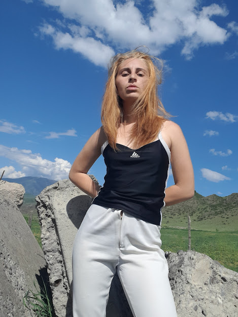

# Tamta Mtchedlidze
### Web Developer

## Contact Information
*  :email:***Email:*** <20100321@ibsu.edu.ge>
*  :telephone_receiver: ***Whatsapp:*** <+995598831156>
* :point_right: ***LinkedIn:*** [Tamta Mtchedlidze](https://link-url-here.org)
*  :point_right:***Github:*** [BlackDragon](https://link-url-here.org)

##summary
* Junior Web Developer I ,with more than 1  year of experience is seeking to obtain a creative and challenging position
that utilizes current knowledge of web development and design. Having a positive outlook and am always willing
to learn new traits. I work well both independently and as part of a team. *

## Education
+ ### International Black Sea University
   #### Business Management
    ##### 2020-present
+ ### University of the People
   #### Informational Technologies
    #####  October 2022-present

## :muscle:skills:
- Javascript
- HTML
- CSS
- Bootstrap
- Sass
- PHP
- Drupal
- Git
- Github
- Phyton
-Angular

## Courses and Bootamps:
- * Web Development course  at Freecodecamp*
- * Full-stack Developer course at Bitoid*
- * Web Develoment Bootcamp at Classcentral*
- * Javascript Bootcamp at Classcentral*
- *RS Schools Course «JavaScript/Front-end. Stage 0» (in progress)*
- *Data analyses course at Epam  ( in progress)*

## :memo:Work experience
### Full-stack Developer
**Bitoid **
###### june 2022-september 2022

*Responsibilities:
-Work with development teams and product managers to ideate software solutions
-Design client-side and server-side architecture
-Build  front-end and back-end   for the different websites
-Build Databases *

### Lead Front-end Developer
**start-up**
###### september 2022 -present
- Working closely with other developers
- Creating and integrating user interfaces
- Designing and developing new features and functionality for existing and new  systemsProviding technical support for existing applications, systems, and infrastructure as needed
- Debugging code to find and fix errors in existing applications
- Communicating with clients or other team members to clarify details about project objectives and requirements

## languages
+ **Georgian** - Native
+ **English** - Advanced
+ **Spanish** - Basic

## Soft Skills
* Critical thinking and problem solving
* Fast learner
* Interpersonal skills
* Communication skills
* Stress resistance
* Effectoive time management
* Organizing skills
* Leadership

